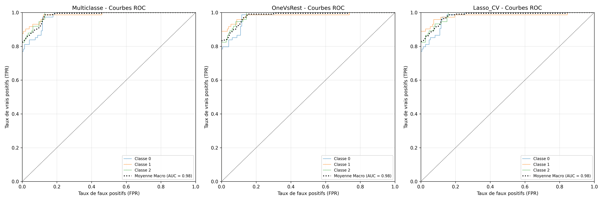
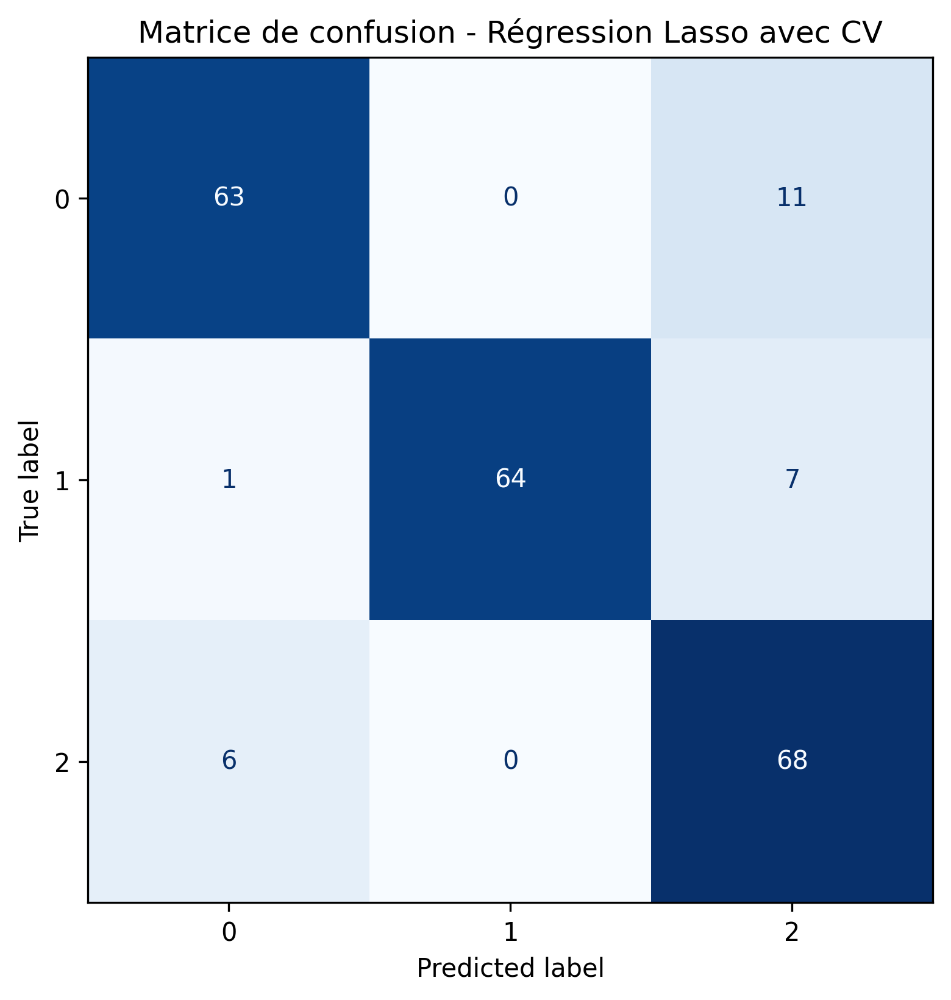

```{python}
from pathlib import Path
import pandas as pd
from IPython.display import Markdown, display

BASE_DIR = Path("..")
TABLES_DIR = BASE_DIR / "reports" / "tables"
FIGURES_DIR = BASE_DIR / "reports" / "figures"

lasso_metrics = pd.read_csv(TABLES_DIR / "lasso_metrics.csv")
coef_lasso = pd.read_csv(TABLES_DIR / "lasso_cv_coefficients.csv")
lasso_best_c = pd.read_csv(TABLES_DIR / "lasso_best_c.csv")

```


Les résultats de la régression logistique avec toutes les variables et sans pénalisation sont très bons. Cependant, il peut être intéressant de rechercher un modèle plus parcimonieux, n'incluant que les variables ayant la plus grande influence sur le niveau de stress. On effectue donc une régression logistique avec pénalisation l1 (Lasso), pour mettre directement les variables les moins informatives à zéro.
La fonction *LogisticRegression* ne permet pas de combiner une pénalisation l1 avec une approche multi-classe où l'on compare chacune des classes avec le solver *liblinear*. On adopte donc la stratégie '*one vs the rest*', qui prend une valeur de la variable 'niveau_stress' comme référence. On a vu précédemment que cette stratégie, dans le cas sans pénalisation, fournissait des résultats semblables à la méthode multiclasse.

```{python}
coef_lasso
```

### Régression Lasso avec validation croisée

Nous améliorons très légèrement les performances du modèle, en comparaison avec la régression non pénalisée, avec une précision passée de $0.877$ à $0.886$. 

Nous nous intéressons également aux courbes ROC, classe par classe.



Les résultats sont dans les trois cas meilleurs pour le modèle OneVsRest non pénalisé : la courbe ROC est au dessus de celle associée au modèle Lasso.

# Validation croisée

Pour améliorer cette régression, nous réalisons des régressions par validation croisée afin de choisir au mieux la constante de pénalisation $C$ associée au modèle Lasso.

On donne les intervalles de confiance de l'*accuracy score* pour chacun des trois modèles de régression. Pour les deux premiers, sans pénalisation, les résultats sont presque égaux, avec une incertitude plus élevée pour la régression multiclasse que OneVsRest. Si l'*accuracy score* semble plus élevé pour la régression Lasso, en réalité l'intervalle de confiance est également plus grand *ie* le modèle est moins précis.

```{python}
lasso_best_c
```

Enfin, nous regardons la matrice de confusion de cette nouvelle régression, ainsi que les courbes ROC, classe par classe.



Le modèle Lasso avec constante choisie par validation croisée a un score AUC aussi bon que le modèle OneVsRest dans les trois cas. On dispose donc d'un modèle plus parcimonieux avec des performances équivalentes au modèle incluant toutes les variables explicatives.