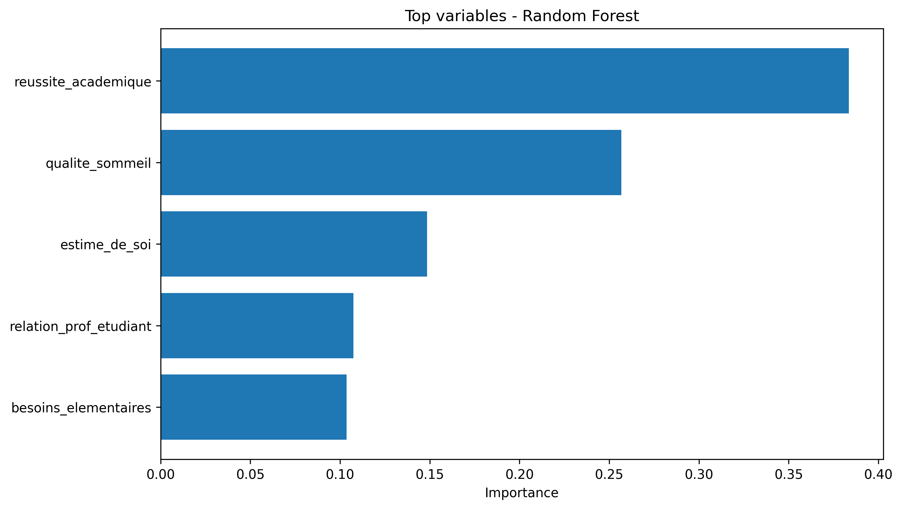

```{python}
from pathlib import Path
import pandas as pd
from IPython.display import Markdown, display

BASE_DIR = Path("..")
TABLES_DIR = BASE_DIR / "reports" / "tables"
FIGURES_DIR = BASE_DIR / "reports" / "figures"

performance_random_forest = pd.read_csv(TABLES_DIR / "performance_random_forest.csv")
performance_trees = pd.read_csv(TABLES_DIR / "performance_trees.csv")
random_forest_feature_importance = pd.read_csv(TABLES_DIR / "random_forest_feature_importance.csv")
tree_model_comparison = pd.read_csv(TABLES_DIR / "roc_logistic_summary.csv")
lasso_selected_variables = pd.read_csv(TABLES_DIR / "lasso_selected_variables.csv")
performance_boosting = pd.read_csv(TABLES_DIR / "performance_boosting.csv")


```

Nous choisissons ensuite de tester un type de modèle différent : la forêt aléatoire, en espérant améliorer encore les performances.

Pour rappel, avec le modèle de régression Lasso, on avait en regroupant les résultats des trois régressions possibles : 
```{python}
lasso_selected_variables
```

En entrainant une forêt aléatoire, les *features* les plus importances sont les suivantes.




Nous choisissons dans la suite de considérer la même base de données avec un nombre de variables explicatives réduit aux cinq plus importantes données par le résultat ci-dessus. Le but est d’obtenir un modèle parcimonieux et plus facilement interprétable et visualisable qu’en conservant les vingt variables explicatives initiales. Nous entraînons un modèle de forêt aléatoire sur les données, directement avec *fine tuning* des paramètres (nombre d’arbres, profondeur, nombre minimal de données pour chaque *split*). Nous évaluons la performance du modèle en calculant la racine de l’erreur quadratique sur les échantillons *train* (contrôle de l’*overfitting*) et *test*.
Le résultat obtenu est le suivant : 


```{python}
performance_random_forest
```

On compare les résultats du modèle de forêts aléatoire au *Gradient Boosting*, une extension a priori un plus performante de ces modèles. On *fine tune* ici aussi directement les paramètres afin d’obtenir directement le modèle le plus performant possible. On constate que l’erreur réalisée est légèrement plus importante que celle obtenue avec le modèle de forêts aléatoires. 

```{python}
performance_boosting
```