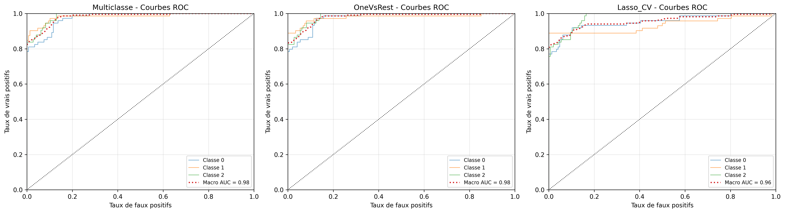

On réalise deux types de régressions : avec et sans pénalisation. La variable d’intérêt, relative au niveau de stress, encode trois modalités différentes. Or une régression logistique classique est utile pour la classification binaire. On choisit donc de comparer dans le cas de la régression sans pénalisation les méthodes multiclasse et *One Vs Rest*. On réalise enfin une régression Lasso, afin d’avoir un aperçu des variables explicatives les moins importantes (mises à zéro) et d’obtenir un modèle plus parcimonieux. On réalise directement une régression avec validation croisée, afin de sélectionner la valeur de pénalisation fournissant les meilleurs résultats. On obtient pour ces trois modèles des performances équivalentes. 


```{python}
from pathlib import Path
import pandas as pd
from IPython.display import Markdown, display

BASE_DIR = Path("..")
TABLES_DIR = BASE_DIR / "reports" / "tables"
FIGURES_DIR = BASE_DIR / "reports" / "figures"

logistic_metrics = pd.read_csv(TABLES_DIR / "logistic_metrics.csv")
coef_multiclass = pd.read_csv(TABLES_DIR / "logistic_multiclass_coefficients.csv")
coef_ovr = pd.read_csv(TABLES_DIR / "logistic_ovr_coefficients.csv")
roc_summary = pd.read_csv(TABLES_DIR / "roc_logistic_summary.csv")

coef_multiclass = coef_multiclass.rename(columns={coef_multiclass.columns[0]: "variable"})
coef_ovr = coef_ovr.rename(columns={coef_ovr.columns[0]: "variable"})

lasso_metrics = pd.read_csv(TABLES_DIR / "lasso_metrics.csv")
coef_lasso = pd.read_csv(TABLES_DIR / "lasso_cv_coefficients.csv")
lasso_best_c = pd.read_csv(TABLES_DIR / "lasso_best_c.csv")

```

```{python}
logistic_metrics
```


```{python}
coef_multiclass

abs_multiclass = coef_multiclass.copy()
for col in abs_multiclass.columns[1:]:
    abs_multiclass[col] = abs(abs_multiclass[col])

top_multiclass = (
    abs_multiclass
    .assign(max_abs_coef=abs_multiclass.iloc[:, 1:].max(axis=1))
    .sort_values("max_abs_coef", ascending=False)
    .loc[:, ["variable", "max_abs_coef"]]
    .head(10)
)

display(Markdown("### Variables les plus influentes — modèle multiclasse"))
display(Markdown("Nous pouvons également repérer les variables ayant le plus d'impact dans les régressions."))
top_multiclass
```

```{python}
coef_ovr
```


En utilisant ces modèles nous pouvons donc prédire les labels correspondants. Afin de comparer les performances des différents modèles, nous nous intéressons à leur matrice de confusion, afin de visualiser la répartitions des labels, ainsi que les métriques classiques : accuracy, précision et recall.

```{python}
best_model = logistic_metrics.sort_values("accuracy", ascending=False).iloc[0]
display(Markdown(
    f"**Meilleur modèle logistique selon l'accuracy :** "
    f"`{best_model['modele']}` avec une accuracy de **{best_model['accuracy']:.3f}**."
))
```


## Matrices de confusion

### Régression logistique multiclasse


### Régression logistique One-vs-Rest


```{python}
roc_summary
```

```{python}
roc_macro = (
    roc_summary[roc_summary["classe"].astype(str) == "macro"]
    .sort_values("auc", ascending=False)
    .reset_index(drop=True)
)

display(Markdown("### Comparaison macro-AUC"))
roc_macro
```


## Courbes ROC
Une autre manière de visualiser les performances des trois modèles et de tracer les courbes ROC. Les résultats des trois méthodes sont très satisfaisants et comparables.

Nous observons que les deux méthodes de régressions fournissent des résultats équivalents, les courbes sont superposées, il n'y en n'a pas une très clairement au dessus de l'autre dans chacun des trois cas.

Les résultats des prédictions sont pour les deux méthodes, les meilleurs s'agissant de la classe 1 et les moins bons s'agissant de la classe 0.


```{python}
roc_summary
```


```{python}
abs_ovr = coef_ovr.copy()
for col in abs_ovr.columns[1:]:
    abs_ovr[col] = abs(abs_ovr[col])

top_ovr = (
    abs_ovr
    .assign(max_abs_coef=abs_ovr.iloc[:, 1:].max(axis=1))
    .sort_values("max_abs_coef", ascending=False)
    .loc[:, ["variable", "max_abs_coef"]]
    .head(10)
)

display(Markdown("### Variables les plus influentes — modèle One-vs-Rest"))
display(Markdown("Enfin, ces modèles nous permettent d’évaluer l’influence des variables explicatives sur la variable d’intérêt (ici le niveau de stress) :"))
top_ovr
```

La tension artérielle et le soutien social ressortent comme les variables ayant en valeur absolue le plus grand impact.
La régression Lasso nous permet d’exclure certaines variables en mettant leur coefficient à zéro. Nous obtenons :

```{python}
coef_lasso
```

# Validation croisée

Pour améliorer cette régression, nous réalisons des régressions par validation croisée afin de choisir au mieux la constante de pénalisation $C$ associée au modèle Lasso.

On donne les intervalles de confiance de l'*accuracy score* pour chacun des trois modèles de régression. Pour les deux premiers, sans pénalisation, les résultats sont presque égaux, avec une incertitude plus élevée pour la régression multiclasse que OneVsRest. Si l'*accuracy score* semble plus élevé pour la régression Lasso, en réalité l'intervalle de confiance est également plus grand *ie* le modèle est moins précis.

```{python}
lasso_best_c
```

Enfin, nous regardons la matrice de confusion de cette nouvelle régression, ainsi que les courbes ROC, classe par classe.


Le modèle Lasso avec constante choisie par validation croisée a un score AUC aussi bon que le modèle OneVsRest dans les trois cas. On dispose donc d'un modèle plus parcimonieux avec des performances équivalentes au modèle incluant toutes les variables explicatives.
