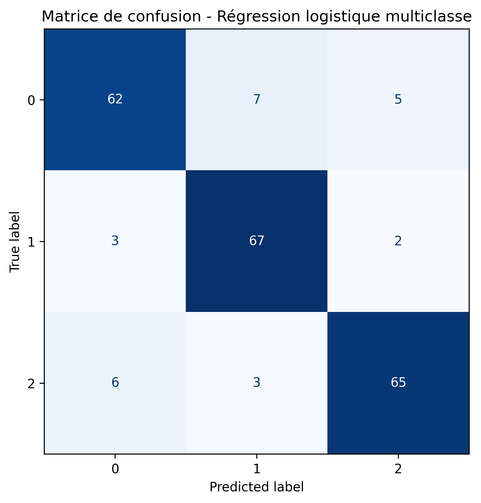
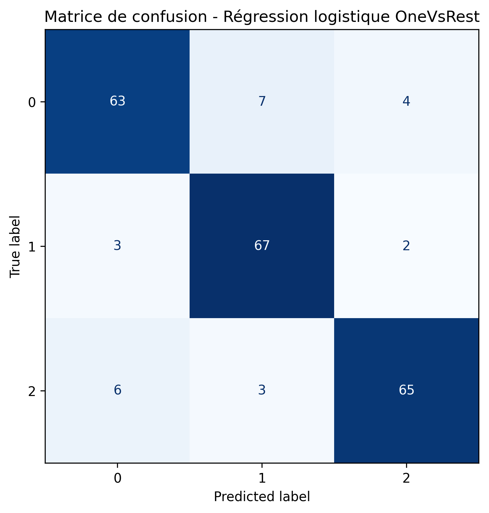

## Présentation du projet

À partir d’un jeu de données anonymisées sur le **stress des élèves dans le supérieur en France**, ce projet vise à :

- analyser les facteurs **physiques**, **psychologiques**, **scolaires** et **économiques** associés au stress ;
- prédire le **niveau de stress** ou une autre variable d’intérêt ;
- comparer les performances de plusieurs modèles de classification.


## Données
- Variable cible : `niveau_stress`
- Variables explicatives :
  - sommeil
  - charge académique
  - santé mentale
  - contexte économique
  - etc.

## Modèles testés

- **Régression logistique** simple multiclasse et One-vs-Rest  
- **Régression Lasso** avec validation croisée  
- **Random Forest** avec fine tuning  
- **Boosting** avec fine tuning

## Régression logistique


On réalise une régression logistique sans pénalisation, pour avoir un premier aperçu de la performance d'un modèle simple. La variable d'intérêt (ou le label), encodant le niveau de stress, peut prendre trois valeurs 0, 1, 2. On choisit de comparer la régression multi-classes à la méthode OneVsRest qui fixe une classe de référence et concatène les deux autres afin d'effectuer une régression binaire. Etant donné que notre variable stress est encodée selon trois niveaux, trois régressions OneVsRest sont possibles.


## Résultats pour la régression logistique

- Pour la régression logistique multiclasse,



## Résultats pour la régression logistique
- Pour la régression OneVsRest,



## Régression Lasso
- Les résultats de la régression logistique avec toutes les variables et sans pénalisation sont très bons. 
- Cependant, il peut être intéressant de rechercher un modèle plus parcimonieux, n’incluant que les variables ayant la plus grande influence sur le niveau de stress. On effectue donc une régression logistique avec pénalisation l1 (Lasso), pour mettre directement les variables les moins informatives à zéro. 

## Régression Lasso : résultats


## Comparaison des courbes ROC


## Random Forest

- Nous choisissons ensuite de tester un type de modèle différent : la forêt aléatoire, en espérant améliorer encore les performances.
- Nous choisissons dans la suite de considérer un dataset ‘X_S’ ne conservant que les cinq premières variables par ordre d’importance données ci-dessus. Nous choisissons également de limiter la profondeur de l’arbre à 10 afin d’éviter l’overfitting, puis à 5.

## Random Forest : résultats

```{python}
#| output: asis
from pathlib import Path
import pandas as pd

rf_path = Path("reports/tables/performance_random_forest.csv")

if rf_path.exists():
    pd.read_csv(rf_path.to_markdown(index=False))
else:
    print("Fichier performance_random_forest.csv introuvable")
```

## Boosting

Nous testons à présent l’approche par Gradient Boosting. Il s’agit dans un premier temps de fixer les hyperparamètres. 
 On choisit  max_depth=5 pour comparer les deux cas. On garde le nombre d’arbres/d’itérations à sa valeur par défaut n_estimators = 100. De même, on conserve learning_rate=0.1 pour limiter l’overfitting.

## Boosting : résultats

```{python}
#| output: asis
from pathlib import Path
import pandas as pd

boosting_path = Path("reports/tables/performance_boosting.csv")

if boosting_path.exists():
    pd.read_csv(boosting_path.to_markdown(index=False))
else:
    print("Fichier performance_boosting.csv introuvable")
```